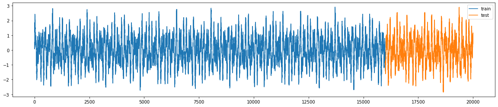
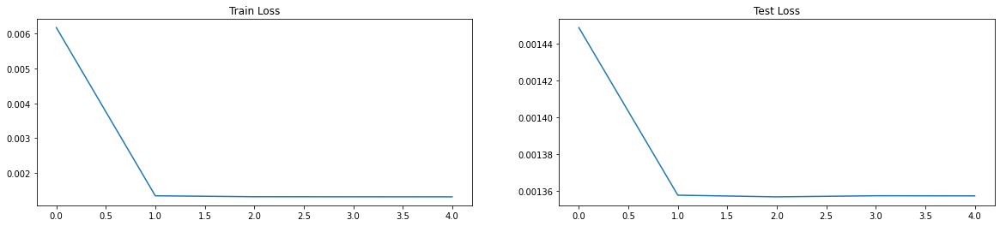
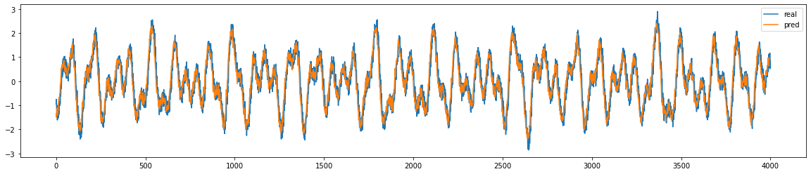

# Série Temporal

- O objetivo deste repositório é o desenvolvimento de um notebook para treinamento e aprendizado para solução de séries temporais utilizando redes neurais e camadas [LSTM](https://pytorch.org/docs/stable/generated/torch.nn.LSTM.html).  

- No [notebook](./Analise%20com%20LSTM%20-%20Pytorch.ipynb) criamos uma função que gera uma curva bem aleatória, porém cíclica, pois é formada por senoides. Isso talvez já seja um problema pois problemas na vida real não apresentam esses ciclos bem definidos. Mas como aqui a tarefa é de aprendizado, vamos continuar utilizando dessa forma.  

- A função tem o seguinte formato:  


- Fazemos a divisão do dataset em treino-teste para avaliação.  
- Criamos também uma classe para carregar os dados além de uma classe para criar o modelo.  

- Para classe modelo temos:  
```
class custom_model(nn.Module):

    def __init__(self, input_dim, hidden_dim, n_layers):
        super(custom_model, self).__init__()
        self.input_dim = input_dim
        self.hidden_dim = hidden_dim
        self.n_layers = n_layers
        self.lstm = nn.LSTM(input_size=self.input_dim, hidden_size=self.hidden_dim, num_layers=self.n_layers, batch_first=True)
        self.net = nn.Sequential(
            nn.Linear(in_features=self.hidden_dim, out_features=64),
            nn.LeakyReLU(),
            nn.Linear(in_features=64, out_features=1)
        )
    
    def forward(self, x):
        c0 = torch.zeros((self.n_layers, len(x), self.hidden_dim))
        h0 = torch.zeros((self.n_layers, len(x), self.hidden_dim))

        output, (c0, h0) = self.lstm(x, (h0, c0))

        output = output.reshape(len(x), -1)

        return self.net(output)
```

---
## Resultados

- Como o problema aqui no notebook foi bem simples, ainda mais que a função "aleatória" é cíclica, a convergência foi bem rápida, conforme vemos nos gráficos:  


- A predição para a parte de teste do dataset:  


---
## Conclusões

- A predição para a parte teste do dataset é muito boa, isso se deve porque os dados são cíclicos. Pegando dados mais reais talvez a performance não seja tão boa assim, mas o notebook serviu para aprendizado de implementação de uma rede neural utilizando camadas [LSTM](https://pytorch.org/docs/stable/generated/torch.nn.LSTM.html).